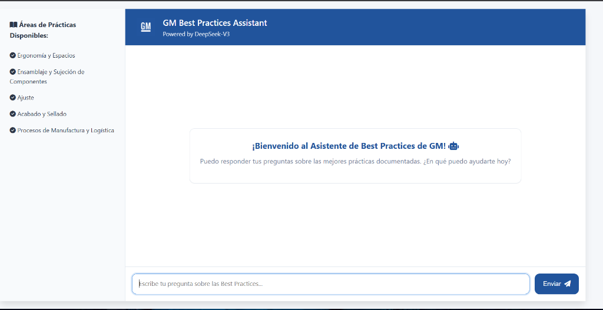

# Chatbot-GM 🤖


## 📸 Interfaz del Chatbot



_GM Best Practices Assistant - Interfaz principal mostrando las áreas de prácticas disponibles y el asistente conversacional powered by DeepSeek-V3_

## 📖 Descripción

Un chatbot inteligente basado en Django que utiliza **Retrieval-Augmented Generation (RAG)** para responder preguntas sobre documentación de General Motors. El sistema combina búsqueda semántica con modelos de lenguaje avanzados para proporcionar respuestas precisas y contextuales.

## 🌟 Características Principales

- **RAG (Retrieval-Augmented Generation)**: Sistema de búsqueda semántica usando FAISS y LangChain
- **Embeddings Eficientes**: Utiliza `sentence-transformers/all-MiniLM-L6-v2` para generar embeddings de alta calidad
- **Modelo de Lenguaje Avanzado**: Integración con DeepSeek-V3 a través de HuggingFace Inference API
- **Respuestas Multimodales**: Incluye texto e imágenes relevantes en las respuestas
- **Interfaz Web Moderna**: UI intuitiva construida con Django
- **Procesamiento de PDFs**: Carga y procesa documentos PDF automáticamente
- **Caché de Vectores**: Almacenamiento persistente del índice FAISS para respuestas rápidas

## 🏗️ Arquitectura

```
Chatbot-GM/
├── myapp/                      # Aplicación principal Django
│   ├── data/                   # Documentos PDF y índice FAISS
│   │   ├── *.pdf              # Documentos fuente
│   │   └── faiss_index/       # Índice vectorial persistente
│   ├── utils/                  # Utilidades
│   │   └── rag_service.py     # Servicio RAG principal
│   ├── static/                 # Archivos estáticos
│   │   └── images/BP/         # Imágenes de referencia
│   ├── views.py               # Lógica de vistas
│   └── models.py              # Modelos de datos
├── mysite/                     # Configuración Django
├── templates/                  # Plantillas HTML
├── requirements.txt           # Dependencias Python
├── manage.py                  # Script de gestión Django
└── .env                       # Variables de entorno
```

## 🚀 Instalación

### Prerrequisitos

- Python 3.8 o superior
- pip (gestor de paquetes de Python)
- Git

### Pasos de Instalación

1. **Clonar el repositorio**

   ```bash
   git clone https://github.com/Alkachino/Chatbot-GM.git
   cd Chatbot-GM
   ```

2. **Crear y activar entorno virtual**

   ```bash
   # Windows
   python -m venv venv
   venv\Scripts\activate

   # Linux/Mac
   python3 -m venv venv
   source venv/bin/activate
   ```

3. **Instalar dependencias**

   ```bash
   pip install -r requirements.txt
   ```

4. **Configurar variables de entorno**

   Crea un archivo `.env` en la raíz del proyecto con el siguiente contenido:

   ```env
   HF_API_TOKEN=tu_token_de_huggingface
   SECRET_KEY=tu_clave_secreta_django
   DEBUG=True
   ```

   > **Nota**: Obtén tu token de HuggingFace en [https://huggingface.co/settings/tokens](https://huggingface.co/settings/tokens)

5. **Preparar documentos**

   Coloca tus archivos PDF en el directorio `myapp/data/`:

   ```bash
   # Los PDFs deben estar en formato .pdf
   myapp/data/tu_documento.pdf
   ```

6. **Inicializar la base de datos**

   ```bash
   python manage.py migrate
   ```

7. **Inicializar el índice RAG**

   El índice FAISS se creará automáticamente la primera vez que ejecutes el servidor. Esto puede tardar unos minutos dependiendo del tamaño de tus documentos.

## 💻 Uso

### Ejecutar el Servidor de Desarrollo

```bash
python manage.py runserver
```

El servidor estará disponible en `http://127.0.0.1:8000/`

### Interactuar con el Chatbot

1. Abre tu navegador y ve a `http://127.0.0.1:8000/`
2. Escribe tu pregunta en el campo de texto
3. El chatbot buscará información relevante en los documentos PDF
4. Recibirás una respuesta con texto e imágenes relacionadas (si aplica)

### Reconstruir el Índice FAISS

Si actualizas los documentos PDF, puedes forzar la reconstrucción del índice:

```python
# En myapp/views.py, modifica la inicialización:
rag_service.initialize_vector_store(force_rebuild=True)
```

## 🔧 Configuración Avanzada

### Parámetros del RAG Service

Puedes ajustar los parámetros del servicio RAG en `myapp/views.py`:

```python
rag_service = RAGService(
    data_dir='myapp/data',      # Directorio de documentos
    chunk_size=1000,             # Tamaño de chunks de texto
    chunk_overlap=200            # Superposición entre chunks
)
```

### Ajustar el Número de Documentos Recuperados

En `myapp/views.py`, línea 98:

```python
context, retrieved_docs = rag_service.get_relevant_context(user_message, k=3)
# k = número de chunks relevantes a recuperar
```

### Configurar el Modelo de Lenguaje

Modifica los parámetros del modelo en `myapp/views.py`:

```python
response = client.chat.completions.create(
    model="deepseek-ai/DeepSeek-V3-0324",
    max_tokens=600,      # Tokens máximos en la respuesta
    temperature=0.3,     # Creatividad (0.0 - 1.0)
    top_p=0.9           # Nucleus sampling
)
```

## 📚 Tecnologías Utilizadas

### Backend

- **Django 5.2**: Framework web
- **LangChain**: Framework para aplicaciones LLM
- **FAISS**: Búsqueda de similitud vectorial
- **HuggingFace Transformers**: Modelos de embeddings
- **Sentence Transformers**: Generación de embeddings semánticos

### Procesamiento de Documentos

- **PyPDF**: Extracción de texto de PDFs
- **RecursiveCharacterTextSplitter**: División inteligente de texto

### Modelo de IA

- **DeepSeek-V3**: Modelo de lenguaje para generación de respuestas
- **all-MiniLM-L6-v2**: Modelo de embeddings ligero y eficiente

## 🔍 Cómo Funciona el RAG

1. **Indexación** (Primera ejecución):

   - Los PDFs se cargan desde `myapp/data/`
   - El texto se divide en chunks de 1000 caracteres con 200 de superposición
   - Cada chunk se convierte en un vector usando embeddings
   - Los vectores se almacenan en un índice FAISS

2. **Consulta** (Cada pregunta):
   - La pregunta del usuario se convierte en un vector
   - FAISS busca los 3 chunks más similares
   - Los chunks relevantes se envían como contexto al LLM
   - El LLM genera una respuesta basada en el contexto
   - Se incluyen imágenes relevantes si están disponibles

## 🐛 Solución de Problemas

### Error: "No PDF files found"

- Verifica que los archivos PDF estén en `myapp/data/`
- Asegúrate de que tengan la extensión `.pdf`

### Error: "Token de API no configurado"

- Verifica que el archivo `.env` existe
- Confirma que `HF_API_TOKEN` está correctamente configurado

### El índice FAISS no se carga

- Elimina la carpeta `myapp/data/faiss_index/`
- Reinicia el servidor para reconstruir el índice

### Respuestas lentas

- Reduce el valor de `k` en `get_relevant_context()`
- Considera usar un modelo de embeddings más pequeño
- Reduce `max_tokens` en la configuración del LLM

## 🤝 Contribuir

Las contribuciones son bienvenidas. Por favor:

1. Haz fork del proyecto
2. Crea una rama para tu feature (`git checkout -b feature/AmazingFeature`)
3. Commit tus cambios (`git commit -m 'Add some AmazingFeature'`)
4. Push a la rama (`git push origin feature/AmazingFeature`)
5. Abre un Pull Request

## 📝 Licencia

Este proyecto es de uso interno para General Motors.

## 👥 Autor

- **Alkachino** - [GitHub](https://github.com/Alkachino)

## 🙏 Agradecimientos

- HuggingFace por la infraestructura de modelos
- LangChain por el framework RAG
- Facebook AI Research por FAISS
- La comunidad de Django

---

**Nota**: Este proyecto está en desarrollo activo. Las características y la documentación pueden cambiar.
